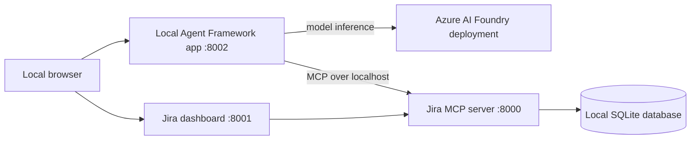

# JiraLite Local MCP Demos

A local-first workspace for MCP servers and Agent Framework demonstrations. The JiraLite service and database run on this machine; Azure AI Foundry supplies only LLM inference.

It includes:

- 🧠 An MCP server built with FastMCP
- 🌐 Streamable HTTP MCP transport
- 🔌 A FastAPI REST backend
- 🗄️ A local SQLite database
- 🌱 Seed/sample data for quick testing
- 🖥️ A single-page web dashboard
- 🤖 A Chainlit GUI for the Microsoft Agent Framework demo, including visible MCP tool calls

## Local-first architecture



The Foundry model never calls `localhost`. The local agent receives tool calls from the model and invokes the local MCP server itself.

## Workspace layout

```text
app/                         Existing JiraLite API, MCP server, database, and web application
demos/jira_foundry_agent/    Local Agent Framework consumer of the Jira MCP server
scripts/                     Development launchers
data/                        Local SQLite data (Git-ignored)
```

Future MCP implementations should be added under `servers/` or `packages/`, while applications that consume them belong under `demos/`.

## Parks Canada booking MCP demo

`servers/parks_canada_booking_mcp/` is a standalone, local-only booking demo based on a simplified Parks Canada reservation flow. It includes 49 seeded parks, 20 campgrounds, 98 campsites, and 15 roofed accommodations. It is demo data only; it has no connection to the real Parks Canada Reservation Service.

The source data is stored in `data/parks_canada_seed_data.json`. Initialize or reset the local booking database with:

```powershell
parks-canada-booking-seed
```

Start the MCP server independently with:

```powershell
parks-canada-booking-mcp
```

It listens at `http://127.0.0.1:8008/mcp` and exposes:

- `search_parks`
- `search_availability`
- `get_site_details`
- `get_site_calendar`
- `create_reservation`
- `get_reservation`
- `cancel_reservation`
- `list_user_reservations`
- `browse_availability` — lists each matching unit's open date ranges for a selected month.

`python run.py` also starts the service. The SQLite database is written to `data/parks_canada_booking.db` and is Git-ignored.

### Parks Canada booking chat demo

`demos/parks_booking_agent/` is a Chainlit chat application connected to the local Parks Canada Booking MCP server. It uses the existing Azure AI Foundry chat deployment for inference and keeps the **same Agent Framework session for the life of each browser chat**. Follow-up messages therefore retain prior context, including selected parks, dates, and shortlisted options.

Start the chat independently after the booking MCP server is running:

```powershell
parks-booking-agent
```

Open `http://127.0.0.1:8009`. Example flow:

1. “Find a tent site in Banff for two people from 2026-06-10 to 2026-06-12.”
2. “Show me details for the second option.”
3. “Book it for Alex Example, alex@example.test.”
4. Confirm the displayed reservation summary when prompted.

The agent searches before recommending units and requests explicit confirmation before it creates or cancels a reservation.

### Parks Canada booking dashboard

`demos/parks_booking_dashboard/` is a presenter-friendly companion website for the booking chat. It is available at `http://127.0.0.1:8010` when running `python run.py`, and can be started independently with:

```powershell
parks-booking-dashboard
```

It provides a visual availability explorer that shows open date ranges by site/accommodation, along with a live reservation board that updates as bookings are created in the agent chat. This makes the search and booking state easy to demonstrate to a non-technical audience.

## Markdown RAG MCP server

`servers/markdown_rag_mcp/` is a standalone local RAG server. It is not connected to a demo yet. It stores vectors in a local persistent ChromaDB database and uses an Azure AI Foundry embedding deployment through `DefaultAzureCredential`.

1. Create an embedding-model deployment in your Foundry resource.
2. Set its deployment name as `AZURE_OPENAI_EMBEDDING_MODEL` in `.env`.
3. Copy the Markdown knowledge-base files into `knowledge/` (subdirectories are supported).
4. Index the files:

  ```powershell
  markdown-rag-index
  ```

5. Start the independent MCP server when a future demo needs it:

  ```powershell
  markdown-rag-mcp
  ```

The server binds to `http://127.0.0.1:8003/mcp` and exposes:

- `search_markdown_knowledge` — semantic search with source/chunk citations.
- `rag_index_status` — indexed chunk count.

The vector-store files are written to `data/rag/` and are Git-ignored. Re-run the index command after modifying knowledge files.

## Synthetic PC411 directory MCP server

`servers/pc411_directory_mcp/` is a local clone of a team-directory search tool. It imports the hierarchy in `PC411_Structure.html` and generates **synthetic** personnel only. Names, titles, and `first.last@pc.gc.ca` email addresses are fabricated; this service contains no real employee records.

Initialize the directory once:

```powershell
pc411-directory-import
pc411-directory-seed
```

Run the local MCP server:

```powershell
pc411-directory-mcp
```

It listens at `http://127.0.0.1:8004/mcp/` and provides these tools:

- `search_people`
- `get_person`
- `browse_organization`
- `get_organization_contacts`
- `find_reporting_chain`
- `get_directory_stats`

The synthetic data is deterministic for `PC411_DIRECTORY_SEED=411`; change that setting and rerun the seed command to generate a different sample directory. The local database is `data/pc411_directory.db` and is Git-ignored.

---

## Features

### Core ticket management

- Create tickets
- List and search tickets
- View ticket details
- Edit ticket fields
  - title
  - description
  - priority
  - category
  - requester
  - assignee
  - due date
- Update ticket status
- Assign or unassign tickets
- Archive or restore tickets

### Collaboration features

- Add comments
- View comments
- Track system activity/audit history
- Add and remove watchers
- Add labels/tags
- Upload attachments
- View in-app notifications
- Save and reuse filters

### Productivity features

- Bulk status updates
- Bulk assignment updates
- Ticket stats dashboard
- Overdue ticket detection
- Category and label summaries

### Agent helper features

- Ticket suggestion helper
  - proposes a next-step comment
  - suggests labels and triage direction
- Ticket handoff summary helper
  - compresses status, recent activity, and latest notes

### Supported statuses

- `todo`
- `in_progress`
- `blocked`
- `done`

### Supported categories

- `hardware`
- `software`
- `network`
- `access`
- `other`

---

## Requirements

- Python 3.11+

---

## Installation

Create a virtual environment:

```bash
python -m venv .venv
```

Activate it.

### Windows (PowerShell)

```powershell
.venv\Scripts\Activate.ps1
```

### macOS / Linux

```bash
source .venv/bin/activate
```

Install the project:

```bash
pip install -e .
```

### Azure AI Foundry configuration

Copy `.env.example` to `.env`, then set the endpoint and the name of your Azure AI Foundry/Azure OpenAI model deployment. Authenticate locally with Azure CLI:

```powershell
az login
```

The agent uses `DefaultAzureCredential`, so no API key is stored in the project. The installed Agent Framework provider selects its supported Azure OpenAI Responses API version automatically; do not set a legacy `AZURE_OPENAI_API_VERSION` value in `.env`.

---

## Running the application

Start the Jira services and the Foundry-backed local agent:

```bash
python run.py
```

This launches:

| Service | URL |
| --- | --- |
| Backend API + MCP | http://127.0.0.1:8000 |
| Frontend UI | http://127.0.0.1:8001 |
| Foundry agent Chainlit GUI | http://127.0.0.1:8002 |
| Knowledge Base Agent Chainlit GUI | http://127.0.0.1:8007 |
| Markdown RAG MCP | http://127.0.0.1:8003/mcp |
| Synthetic PC411 Directory MCP | http://127.0.0.1:8004/mcp |
| Parks Canada Booking MCP | http://127.0.0.1:8008/mcp |
| Parks Canada Booking Chat | http://127.0.0.1:8009 |
| Parks Canada Booking Dashboard | http://127.0.0.1:8010 |
| Workspace Agent Chainlit GUI | http://127.0.0.1:8005 |
| MCP Workspace Dashboard | http://127.0.0.1:8006 |

Open the frontend in your browser:

```text
http://127.0.0.1:8001
```

Open the Chainlit agent UI at `http://127.0.0.1:8002`. It connects to the local MCP endpoint at `http://127.0.0.1:8000/mcp` and uses the configured Foundry deployment for inference. Each MCP invocation appears as an expandable **MCP tool** step with its arguments and returned result, making the tool-use flow demonstrable.

On Windows, the equivalent launcher is `scripts/start-local.ps1`.

### MCP Workspace Dashboard

Open `http://127.0.0.1:8006` for a local dashboard that reports service availability and opens each JiraLite interface, Chainlit demo, and MCP endpoint. The dashboard is local-only and does not expose services outside this machine.

The **Workspace Agent** at `http://127.0.0.1:8005` can use all three local MCP services in one conversation:

- JiraLite ticket operations;
- Markdown RAG search; and
- the synthetic PC411 directory.

It shows every tool invocation in expandable Chainlit steps. Before launching the unified demo, ensure the Markdown RAG index and PC411 synthetic directory have been initialized using the commands in their sections below.

The **Knowledge Base Agent** at `http://127.0.0.1:8007` uses only the local Markdown RAG MCP tool. It maintains active-chat context, searches the knowledge base before answering factual questions, and cites retrieved source paths.

---

## Database

Mini Jira MCP uses a local SQLite database:

```text
data/mini_jira.db
```

On first startup, the app automatically creates the database and seeds it with sample tickets, comments, labels, watchers, and notifications.

### Main tables

- `tickets`
- `comments`
- `activity_log`
- `labels`
- `ticket_labels`
- `watchers`
- `attachments`
- `notifications`
- `saved_filters`

---

## MCP endpoint

The streamable HTTP MCP endpoint is available at:

```text
http://127.0.0.1:8000/mcp
```

---

## Available MCP tools

- `create_ticket`
- `list_tickets`
- `get_ticket`
- `edit_ticket`
- `archive_ticket`
- `list_activity`
- `add_comment`
- `list_comments`
- `update_status`
- `assign_ticket`
- `update_category`
- `update_labels`
- `add_watcher`
- `remove_watcher`
- `add_attachment`
- `list_notifications`
- `save_filter`
- `list_filters`
- `bulk_update_status`
- `bulk_assign`
- `suggest_ticket_response`
- `summarize_ticket_handoff`
- `escalate_ticket`
- `get_stats`

---

## Example MCP calls

### Create a ticket

```json
{
  "name": "create_ticket",
  "arguments": {
    "title": "Checkout page fails for guest users",
    "description": "Observed 500 error after clicking Pay Now.",
    "priority": "high",
    "category": "software",
    "labels": ["bug", "checkout"],
    "assignee": "alex",
    "requester": "priya"
  }
}
```

### Edit a ticket

```json
{
  "name": "edit_ticket",
  "arguments": {
    "ticket_id": 1,
    "title": "Checkout page fails for guest users",
    "description": "Observed 500 error after clicking Pay Now for guest flow.",
    "priority": "high",
    "category": "software",
    "assignee": "alex",
    "requester": "priya"
  }
}
```

### Update labels

```json
{
  "name": "update_labels",
  "arguments": {
    "ticket_id": 1,
    "labels": ["bug", "urgent", "checkout"]
  }
}
```

### Get an agent suggestion

```json
{
  "name": "suggest_ticket_response",
  "arguments": {
    "ticket_id": 1
  }
}
```

---

## REST API

The dashboard communicates with the backend through a FastAPI REST API.

### Ticket endpoints

- `GET /api/tickets`
- `GET /api/tickets/{ticket_id}`
- `GET /api/tickets/{ticket_id}/activity`
- `GET /api/tickets/{ticket_id}/comments`
- `POST /api/tickets`
- `PUT /api/tickets/{ticket_id}`
- `PATCH /api/tickets/{ticket_id}/archive`
- `PATCH /api/tickets/{ticket_id}/status`
- `PATCH /api/tickets/{ticket_id}/assign`
- `PATCH /api/tickets/{ticket_id}/category`
- `POST /api/tickets/{ticket_id}/escalate`
- `POST /api/tickets/{ticket_id}/comments`
- `PUT /api/tickets/{ticket_id}/labels`
- `POST /api/tickets/{ticket_id}/watchers`
- `DELETE /api/tickets/{ticket_id}/watchers/{watcher}`
- `POST /api/tickets/{ticket_id}/attachments`

### Notification endpoints

- `GET /api/notifications`
- `PATCH /api/notifications/{notification_id}/read`

### Saved filter endpoints

- `GET /api/filters`
- `POST /api/filters`
- `DELETE /api/filters/{filter_id}`

### Bulk action endpoints

- `PATCH /api/tickets/bulk/status`
- `PATCH /api/tickets/bulk/assign`

### Agent helper endpoints

- `GET /api/agent/suggestions/{ticket_id}`
- `GET /api/agent/handoff/{ticket_id}`

### Stats endpoint

- `GET /api/stats`

---

## Useful API examples

### List tickets

```text
GET /api/tickets?status=todo&q=login&include_archived=true
```

### Create a ticket

```http
POST /api/tickets
Content-Type: application/json
```

```json
{
  "title": "VPN fails from home Wi-Fi",
  "description": "User cannot connect after laptop replacement.",
  "priority": "high",
  "category": "network",
  "labels": ["vpn", "remote"],
  "assignee": "sam",
  "requester": "morgan"
}
```

### Save labels

```http
PUT /api/tickets/1/labels
Content-Type: application/json
```

```json
{
  "labels": ["urgent", "customer-impact"],
  "actor": "dashboard"
}
```

### Bulk assign

```http
PATCH /api/tickets/bulk/assign
Content-Type: application/json
```

```json
{
  "ticket_ids": [1, 2, 4],
  "assignee": "alex",
  "actor": "dashboard"
}
```

---

## Frontend behavior

The web UI currently provides:

- ticket creation
- inline ticket editing
- label editing
- watcher management
- attachment upload
- saved filter management
- notification list
- bulk actions panel
- agent helper buttons
- status-based board columns

The UI polls the backend every **30 seconds**, and also supports manual refresh.

---

## Configuration

The following environment variables are optional:

| Variable | Description |
| --- | --- |
| `MINI_JIRA_DB_PATH` | SQLite database location |
| `MINI_JIRA_BACKEND_HOST` | Backend host |
| `MINI_JIRA_BACKEND_PORT` | Backend port |
| `MINI_JIRA_FRONTEND_HOST` | Frontend host |
| `MINI_JIRA_FRONTEND_PORT` | Frontend port |

Example:

```bash
export MINI_JIRA_BACKEND_PORT=9000
export MINI_JIRA_FRONTEND_PORT=9001

python run.py
```

---

## Notes

This project is intentionally lightweight and intended for local development and AI experimentation.

Current limitations:

- No authentication
- Local-only deployment
- No real-time push updates
- Attachments are stored in SQLite as base64 text, which is fine for demos but not ideal for large files
- No Docker setup required

---

## FastMCP compatibility

The backend currently mounts the MCP app using the current FastMCP HTTP app integration.

If your installed FastMCP version exposes a different integration method, refer to the corresponding FastMCP documentation and adjust the mount logic in `app/mcp_server.py`.
